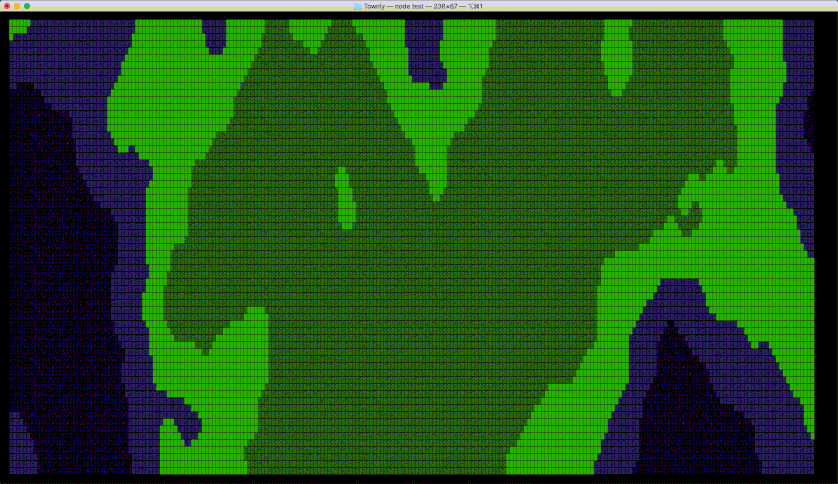
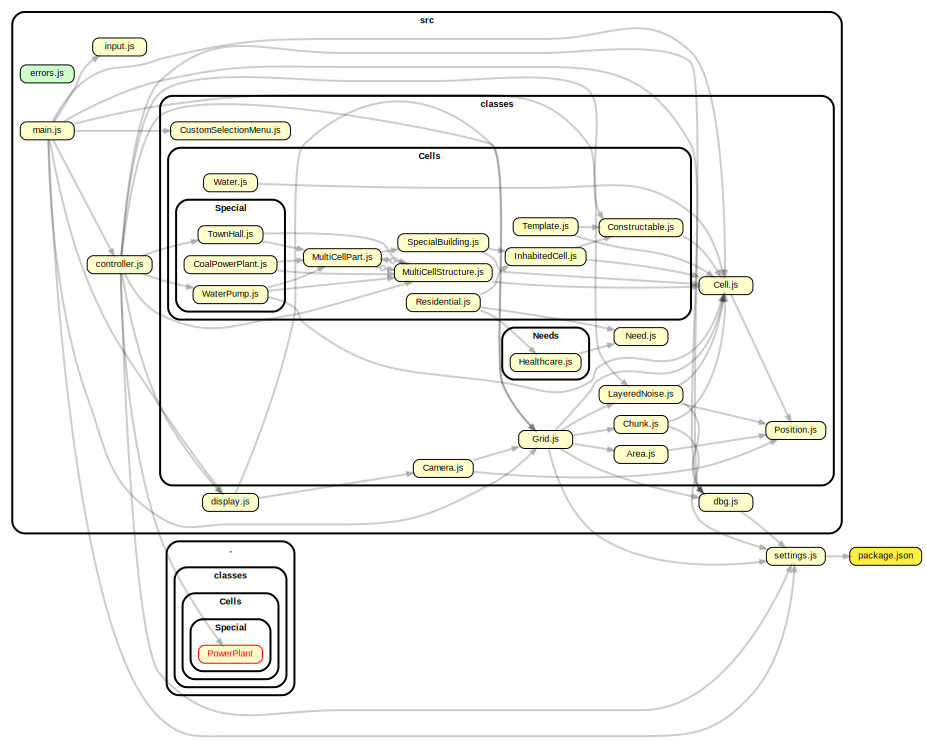

# Townly
## A CLI city building game

  

### [GIF] Current map generation:  

 

 

<!--
## Table of Contents:
- **[Installation](#installation)**
- **[How to Play](#how-to-play)**
-->

### Some resources:
- [Classes overview](./dev/classes.md)
- [Roadmap](./dev/roadmap.md)
- [Class Inheritance Example Diagram](./dev/inheritance.md)

  

### Dependency Graph:  
  
  
  
(To update this file, run the command `npm run dep-graph`)
